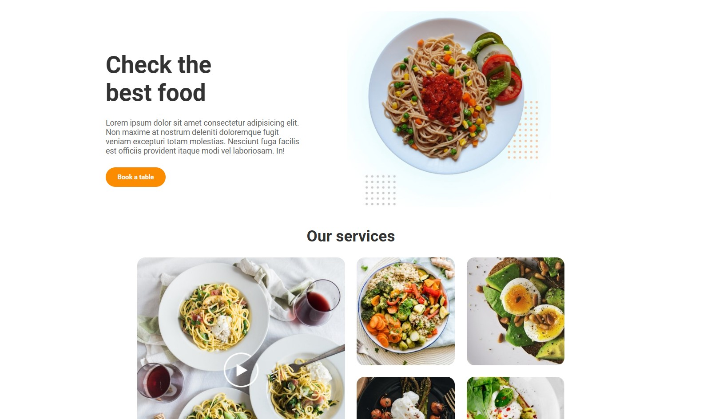

# Curso de Maquetación de Platzi
Este repositorio contiene todo el material y código fuente que he desarrollado durante el **Curso de Maquetación de Platzi**. 
Aquí he aprendido a estructurar sitios web usando HTML y más importante CSS grid siguiendo buenas prácticas de maquetación web.

## 🚀 ¿Qué contiene?
- Archivos HTML bien estructurados
- Estilos CSS organizados
- Proyecto final: una landing page de platos de comida
- Notas personales y recursos adicionales

## 📸 Vista previa

## 🛠️ Tecnologías utilizadas
- HTML5
- CSS3
- Git y GitHub

## Estructura del proyecto:

📦 CSS-Grid-Basico-Platzi
├── index.html
├── styles/
│   └── main.css
├── assets/
│   └── imagenes
└── README.md

## 📚 Resources / References
- Plataforma: [Platzi](https://platzi.com)
- Enlace del curso: [Curso de CSS Grid Básico](https://platzi.com/cursos/css-grid/)

## ✍️ Autor
Hecho con 💚 por @avidevcode
